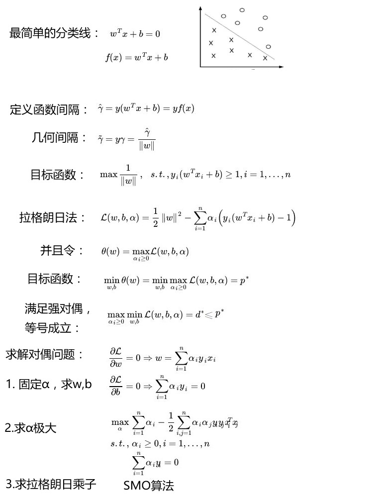
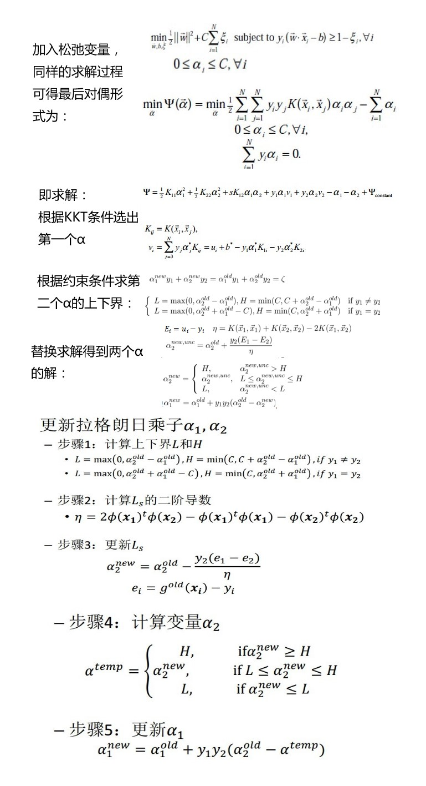
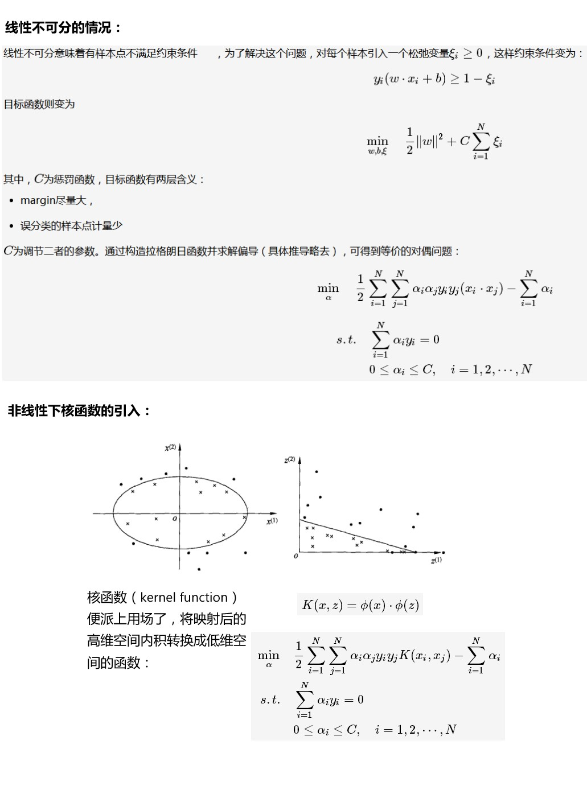
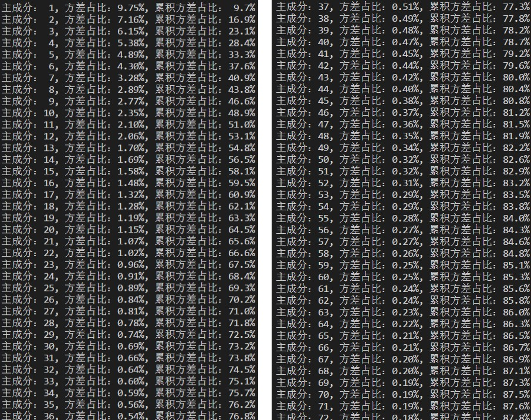
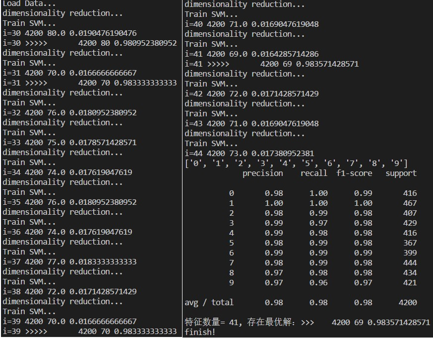

# 基于SVM的数字识别算法研究

## SVM 概述

支持向量机(Support Vector Machines, SVM)：是机器学习当中的一种有监督的学习模型，可以应用于求解分类和回归问题。

## SVM 直观认识

reddit上的[Iddo](http://bytesizebio.net/2014/02/05/support-vector-machines-explained-well/)用了一个很好的例子解释了SVM。


    
对应于SVM来说，这些球叫做 data，棍子叫做 classifie r,最大距离叫做 optimization， 拍桌子叫做 kernelling, 那张纸叫 hyperplane

## SVM 原理

    将上述的直观认识转化为我们最熟悉的数学模型，其实主要内容就是四个部分：

1. SVM的基本原理，从可分到不可分，从线性到非线性
2. 关于带有约束优化的求解方法：优化拉格朗日乘子法和KKT条件
3. 核函数的重要意义
4. 对于优化速度提升的一个重要方法：SMO算法
    参考下边的几个博客，内容十分详细，然后回顾下边的两张图：由于公式太多，这两张图列出了一些主要的公式，并且按照SVM的求解思想将整个思路串起来。

    
    
    

    引用July大神的一句话：“我相信，SVM理解到了一定程度后，是的确能在脑海里从头至尾推导出相关公式的，最初分类函数，最大化分类间隔，max1/||w||，min1/2||w||^2，凸二次规划，拉格朗日函数，转化为对偶问题，SMO算法，都为寻找一个最优解，一个最优分类平面。”

## SVM应用 数字识别

### 数据集的介绍

    在分类研究之前，首先我们需要了解数据的形式和要做的任务：
        手写数字数据集MNIST(Modified National Institute of Standards and Technology)：该数据集是大约4W多图片和标签的组合，2W多待测图片，图片为28*28像素的灰度图，每个像素点的灰度为0到255，标签为该图片中的数字，为0-9中的一个整数。
    需要下载的文件：
* train.csv  训练数据，每行有785列，第一列为标签(label)，之后784*列，每列c为一个像素的灰度值，该像素值对应的坐标为(c/28,c%28)
* test.csv  需要进行分类的数据，每行有784列，没有第一列标签，其他和训练数据一致

        任务是根据训练集训练好自己的模型，然后利用模型对测试集进行分类，并输出成csv的形式存储起来。

### 实现步骤
    > 收集数据
    从kaggle中下载对应的数据集
    test.csv
    train.csv

文本文件格式：

```python
# train.csv
label,pixel0,pixel1,pixel2 ... pixel782,pixel783
3	0	0    0 ... 0	 0 
7	0	0    0 ... 0	 0
2	0	0  255 ... 0	 0
8	0	1   52 ... 0	 0
# test.csv
pixel0,pixel1 ... pixel781,pixel782,pixel783
0	0  ...	68	 0	 0 
0	0  ...	74	 55	 0
0	0  ...	38	 0	 0
0	1  ...	0	 0	 0
```

> 准备数据

        这部分主要是加载test.csv和train.csv文件到我们程序当中，通过pandas库文件打开

```python
# 加载数据
def opencsv():
    print('Load Data...')
    # 使用 pandas 打开
    dataTrain = pd.read_csv('../../../../datasets/getting-started/digit-recognizer/input/train.csv')
    dataTest = pd.read_csv('../../../../datasets/getting-started/digit-recognizer/input/test.csv')
    trainData = dataTrain.values[:, 1:]  # 读入全部训练数据
    trainLabel = dataTrain.values[:, 0]  # 读入对应的第一列的标签
    testData = dataTest.values[:, :]  # 测试全部测试个数据
    return trainData, trainLabel, testData

```

> 分析数据: 

        对数据的分析是一个特别重要的过程，不仅会让我们对数据集有一个直观的认识，更重要的是为在后续优化当中提供理论依据。


```python

def analyse_data(dataMat):
    meanVals = np.mean(dataMat, axis=0)
    meanRemoved = dataMat-meanVals
    covMat = np.cov(meanRemoved, rowvar=0)
    eigvals, eigVects = np.linalg.eig(np.mat(covMat))
    eigValInd = np.argsort(eigvals)

    topNfeat = 100
    eigValInd = eigValInd[:-(topNfeat+1):-1]
    cov_all_score = float(sum(eigvals))
    sum_cov_score = 0
    for i in range(0, len(eigValInd)):
        line_cov_score = float(eigvals[eigValInd[i]])
        sum_cov_score += line_cov_score
        '''
        我们发现其中有超过20%的特征值都是0。
        这就意味着这些特征都是其他特征的副本，也就是说，它们可以通过其他特征来表示，而本身并没有提供额外的信息。

        最前面15个值的数量级大于10^5，实际上那以后的值都变得非常小。
        这就相当于告诉我们只有部分重要特征，重要特征的数目也很快就会下降。

        最后，我们可能会注意到有一些小的负值，他们主要源自数值误差应该四舍五入成0.
        '''
        print('主成分：%s, 方差占比：%s%%, 累积方差占比：%s%%' % (format(i+1, '2.0f'), format(line_cov_score/cov_all_score*100, '4.2f'), format(sum_cov_score/cov_all_score*100, '4.1f')))

```
        通过对数据的特征分析我们可以知道数据之间存在有很严重的相关性，那么我们可以在分类的过程中考虑提取出重要的特征。


```python
def dRCsv(x_train, x_test, preData, COMPONENT_NUM):
    '''
    x_train:训练集中的0.9作为训练集
    x_test:训练集中的0.1作为验证集
    preData:测试集
    COMPONENT_NUM:保留的特征数
    '''
    print('dimensionality reduction...')
    trainData = np.array(x_train)
    testData = np.array(x_test)
    preData = np.array(preData)

    pca = PCA(n_components=COMPONENT_NUM, whiten=True)
    pca.fit(trainData)  # Fit the model with X
    pcaTrainData = pca.transform(trainData)  # Fit the model with X and 在X上完成降维.
    pcaTestData = pca.transform(testData)  # Fit the model with X and 在X上完成降维.
    pcaPreData = pca.transform(preData)  # Fit the model with X and 在X上完成降维.

    return pcaTrainData,  pcaTestData, pcaPreData

def trainModel(trainData, trainLabel):
    print('Train SVM...')
    svmClf = SVC(C=4, kernel='rbf')
    svmClf.fit(trainData, trainLabel)  # 训练SVM
    return svmClf
```
> 训练模型: 

        根据加载分析数据后结果，我们借用网格搜索的思想，把要保留的特征在一定范围内选取最优，找出最高准确率，并且把最高准确率的模型存储起来
```python
#训练过程
def trainDRSVM():
    startTime = time.time()

    # 加载数据
    trainData, trainLabel, preData = opencsv()
    # 模型训练 (数据预处理-降维)
    optimalSVMClf, pcaPreData = getOptimalAccuracy(trainData, trainLabel, preData)

    storeModel(optimalSVMClf, '../../../../datasets/getting-started/digit-recognizer/ouput/Result_sklearn_SVM.model')
    storeModel(pcaPreData, '../../../../datasets/getting-started/digit-recognizer/ouput/Result_sklearn_SVM.pcaPreData')

    print("finish!")
    stopTime = time.time()
    print('TrainModel store time used:%f s' % (stopTime - startTime))

# 训练模型
def trainModel(trainData, trainLabel):
    print('Train SVM...')
    svmClf = SVC(C=4, kernel='rbf')
    svmClf.fit(trainData, trainLabel)  # 训练SVM
    return svmClf

# 存储模型
def storeModel(model, filename):
    import pickle
    with open(filename, 'wb') as fw:
        pickle.dump(model, fw)

# 找出最高准确率
def getOptimalAccuracy(trainData, trainLabel, preData):
    # 分析数据 100个特征左右
    # analyse_data(trainData)
    x_train, x_test, y_train, y_test = train_test_split(trainData, trainLabel, test_size=0.1)
    lineLen, featureLen = np.shape(x_test)
    # print(lineLen, type(lineLen), featureLen, type(featureLen))

    minErr = 1
    minSumErr = 0
    optimalNum = 1
    optimalLabel = []
    optimalSVMClf = None
    pcaPreDataResult = None
    for i in range(30, 45, 1):
        # 评估训练结果
        pcaTrainData,  pcaTestData, pcaPreData = dRCsv(x_train, x_test, preData, i)
        svmClf = trainModel(pcaTrainData, y_train)
        svmtestLabel = svmClf.predict(pcaTestData)

        errArr = np.mat(np.ones((lineLen, 1)))
        sumErrArr = errArr[svmtestLabel != y_test].sum()
        sumErr = sumErrArr/lineLen

        print('i=%s' % i, lineLen, sumErrArr, sumErr)
        if sumErr <= minErr:
            minErr = sumErr
            minSumErr = sumErrArr
            optimalNum = i
            optimalSVMClf = svmClf
            optimalLabel = svmtestLabel
            pcaPreDataResult = pcaPreData
            print("i=%s >>>>> \t" % i, lineLen, int(minSumErr), 1-minErr)
    '''
    展现 准确率与召回率
        precision 准确率
        recall 召回率
        f1-score  准确率和召回率的一个综合得分
        support 参与比较的数量
    参考链接：http://scikit-learn.org/stable/modules/generated/sklearn.metrics.classification_report.html#sklearn.metrics.classification_report
    '''
    # target_names 以 y的label分类为准
    # target_names = ['0', '1', '2', '3', '4', '5', '6', '7', '8', '9']
    target_names = [str(i) for i in list(set(y_test))]
    print(target_names)
    print(classification_report(y_test, optimalLabel, target_names=target_names))
    print("特征数量= %s, 存在最优解：>>> \t" % optimalNum, lineLen, int(minSumErr), 1-minErr)
    return optimalSVMClf, pcaPreDataResult
```


 > 测试算法：便携一个函数来测试不同的和函数并计算错误率

    加载训练好存储的模型，对测试集进行分类并存储结果
```python
def preDRSVM():
    startTime = time.time()
    # 加载模型和数据
    optimalSVMClf = getModel('../../../../datasets/getting-started/digit-recognizer/ouput/Result_sklearn_SVM.model')
    pcaPreData = getModel('../../../../datasets/getting-started/digit-recognizer/ouput/Result_sklearn_SVM.pcaPreData')
    
    # 结果预测
    testLabel = optimalSVMClf.predict(pcaPreData)
    #print("testLabel = %f" % testscore)
    # 结果的输出
    saveResult(testLabel, '../../../../datasets/getting-started/digit-recognizer/ouput/Result_sklearn_SVM.csv')
    print("finish!")
    stopTime = time.time()
    print('PreModel load time used:%f s' % (stopTime - startTime))
```

 > 使用算法：

    根据之前的分析过程，用一个简短的可直接执行的程序总结整体的处理过程，包括加载数据，数据降维，模型训练，数据测试，输出结果
```python
#!/usr/bin/env python
# -*- coding: utf-8 -*-
import csv
import time
import pandas as pd
import numpy as np
from numpy import *
from sklearn.decomposition import PCA
from sklearn.svm import SVC
from sklearn.model_selection import train_test_split


# 加载数据
def opencsv():
    print('Load Data...')
    # 使用 pandas 打开
    dataTrain = pd.read_csv(r'../../../../datasets/getting-started/digit-recognizer/input/train.csv')
    dataTest = pd.read_csv(r'../../../../datasets/getting-started/digit-recognizer/input/test.csv')

    trainData = dataTrain.values[:, 1:]  # 读入全部训练数据
    trainLabel = dataTrain.values[:, 0]
    preData = dataTest.values[:, :]  # 测试全部测试个数据
    return trainData, trainLabel,preData

def dRCsv(x_train, x_test, preData, COMPONENT_NUM):
    print('dimensionality reduction...')
    trainData = np.array(x_train)
    testData = np.array(x_test)
    preData = np.array(preData)
    pca = PCA(n_components=COMPONENT_NUM, whiten=True)
    pca.fit(trainData)  # Fit the model with X
    pcaTrainData = pca.transform(trainData)  # Fit the model with X and 在X上完成降维.
    pcaTestData = pca.transform(testData)  # Fit the model with X and 在X上完成降维.
    pcaPreData = pca.transform(preData)  # Fit the model with X and 在X上完成降维.
    print(sum(pca.explained_variance_ratio_))
    return pcaTrainData,  pcaTestData, pcaPreData

def svmClassify(trainData, trainLabel):
     print('Train SVM...')
     svmClf=SVC(C=4, kernel='rbf')
     svmClf.fit(trainData, trainLabel)  # 训练SVM
     return svmClf

def saveResult(result, csvName):
     with open(csvName, 'wb') as myFile:
         myWriter = csv.writer(myFile)
         myWriter.writerow(["ImageId", "Label"])
         index = 0
         for i in result:
            tmp = []
            index = index+1
            tmp.append(index)
            # tmp.append(i)
            tmp.append(int(i))
            myWriter.writerow(tmp)

def SVM():
     #加载数据
     start_time = time.time()
     trainData, trainLable,preData=opencsv()
     print("load data finish")
     stop_time_l = time.time()
     print('load data time used:%f' % (stop_time_l - start_time))
     trainData, testData,trainLable,testLabletrue = train_test_split(trainData, trainLable, test_size=0.1, random_state=41)#交叉验证 测试集10%
    
     #pca降维
     trainData,testData,preData =dRCsv(trainData,testData,preData,35)  
     # print (trainData,trainLable)


     # 模型训练
     svmClf=svmClassify(trainData, trainLable)
     print ('trainsvm finished')

     # 结果预测
     testLable=svmClf.predict(testData)
     preLable=svmClf.predict(preData)

     #交叉验证
     zeroLable=testLabletrue-testLable
     rightCount=0
     for i in range(len(zeroLable)):
       if zeroLable[i]==0:
          rightCount+=1
     print ('the right rate is:',float(rightCount)/len(zeroLable))
     # 结果的输出
     saveResult(preLable, r'../../../../datasets/getting-started/digit-recognizer/ouput/Result_sklearn_SVM.csv')
     print( "finish!")
     stop_time_r = time.time()
     print('classify time used:%f' % (stop_time_r - start_time))
   
if __name__ == '__main__':
     SVM()

```


参考文献：

[1] http://bytesizebio.net/2014/02/05/support-vector-machines-explained-well/

[2] http://www.cnblogs.com/en-heng/p/5965438.html

[3] http://blog.csdn.net/on2way/article/details/47729419

[4] http://blog.csdn.net/v_july_v/article/details/7624837
